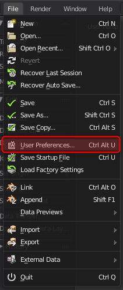
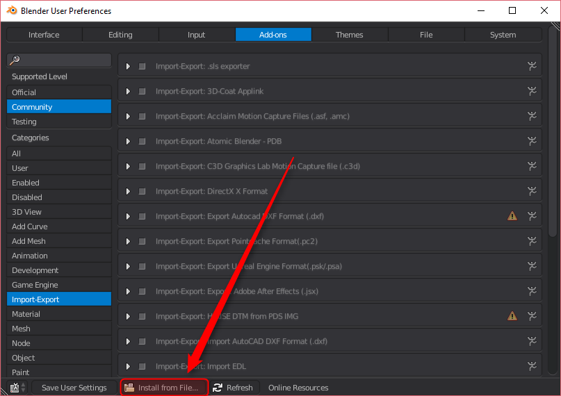
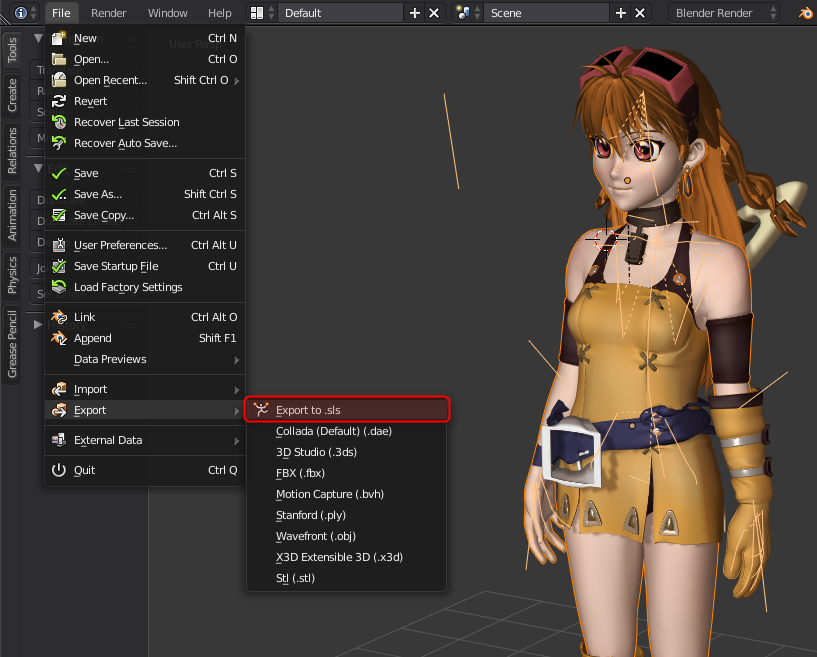

# Sls blender exporter

An exporter to the `.sls` file format for blender

## Description

The `.sls` file format is a custom 3d file format to export skinned mesh from [Blender](https://www.blender.org/).

This format will first use the [YAML](http://yaml.org/) data serialization for clarity.

It mainly focuses on skeletal animation, any other data will be discarded for simplicity (Lights / Camera / Material).

Hopefully, this format will take into account animation techniques like

  - IK solvers
  - Bone constraints

  ## Draft of the file format

  Here is a preview of the targeted result. (for now)

  #### Vector/Quaternion representation

  ```yaml
  skeleton:
    name: <name of the blender armature>
    joints:
      - index: 1
        name: <name of the first blender bone>
        orientation: <direction of the bone (quaternion)>
        parent: <parent of the bone> (-1 if none)
        position: <position of the root joint>

      - index: 2
        name: <name of the second bone>
        orientation: ...
        position: ...

  mesh:
    name: <name of the blender mesh>
    vertices:
      - index: 1
        weights:
          start: <first weight to be applied>
          count: <number of weights applied to the vertex>

      - index: 2
        weights:
          start: <...>
          count: <...>
        ...

    faces:
      - indices: <indices of the vertices> (3 vertices)
      - indices: <...>

    weights:
      - joint: <index of the joint associated to this weight>
        bias: <bias of the weight> (from 0 to 1)
        position: <position of the weight>
  ```


## Setup

First, download this project as a zip file on your computer.
Then open up Blender and go under your user preferences `File > User preferences` (or `Ctrl + Alt + U`)



A new window pops out. Click on the `Add-ons` tab and choose `Install from file` at the bottom of the window.



Then select the .zip archive you have just downloaded

## Export a skinned mesh

Once you have installed the plugin, search for `sls` in the upper left-corner.

Only one add-on should show up (the one you have just installed), make sure it is enabled.


Then, select your mesh and the armature associated with it (the order of the selection does not matter).
Finally, click on `File > Export > Export to .sls` and choose a location to export your mesh to.


